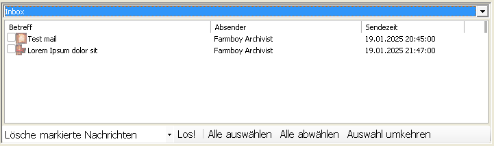

# UI description

A simple description of the UI follows. Screenshows made by running the program through proton/wine, unless otherwise indicated.

## Login 

A simple dialog with the picture of a Dove and the text "Taubenleser" on the left. Immediately to the right of the image are textboxes labeled "Benutzername" (username) and "Kennwort" (password). Underneath is a button labeled "Verbinden" (connect).

On hitting connect ("Verbinden"), the program attempts to retrieve the inbox of the user. If this is successful, the login data is saved internally to use for subsequent requests.

## Main interface

The main window consists of 5 areas, going from top to bottom.

**First** is the main menu, offering these options:

- "Verbindung" (connection)
  - "Verbinden" (connect)
  - "Umeinloggen" (~change user)
  - "Trennen" (disconnect)
  - "In Taskleiste minimieren" (minimize to tray)
  - "Programm beenden" (exit program)
- "Extras" (extra)
  - Einstellungen (settings)
  - Donate!
- Hilfe (help)

**Second** is a row of large buttons with icons. These are:
- "Verbindung" (connection)
- "Briefe holen" (fetch mail)
- "Schreiben" (write)
- "Einstellungen" (settings)

**Third** is the area for the inbox itself, consisting of a combobox offering only the option "Inbox" and a list view with the following columns (screenshot taken with a modified version of the program for illustration purposes):

- "Betreff" (subject)
- "Absender" (sender) - displays the ingame name of the sender
- "Sendezeit" (date and time the mail was sent)

Below the list of mails is also a dropdown offering thes options:
- "Lösche Systemnachrichten" (delete system messages)
- "Lösche ungelesene Nachrichten" (delete unread messages)
- "Lösche gelesene Nachrichten" (delete read messages)
- "Setze markierte Nachrichten auf Ungelesen" (mark selected messages to unread)
- "Lösche markierte Nachrichten" (delete selected messages)
And to the right of that dropdown is the button to execute the selected option ("Los!") as well as buttons to select all messages ("Alle auswäheln"), deselect all messages ("Alle abwählen") and to invert the selection ("Auswahl umkehren").

**Forth** is the reading area (again, screenshot taken from an altered program):

This consists of a tree view for displaying the header information of the mail, a text area for reading the body of the mail and a bar with the buttons "Antworten" (reply) and "Löschen" (delete).

The header information can be expanded to show the name of the sender and the timestamp in addition ot the normally displayed subject:

**Fifth** is the status bar which displays the text "Mails: x neu / y gesamt" on the left and a progress bar on the right. The text is adjusted based on the number of unread mails (`x`) and total mails (`y`) in the inbox.

Unfortunately I was unable to determine the function of the progress bar.

## Settings

Todo: Write UI explanation.

## Write mail

Todo: Write UI explanation.

## Donate

When clicking the "Donate!" button in the main menu, a message box is shown with a text expressing appreciation for the willingness to donate, but telling the user that no donations are necessary. The user is invited to contact the author by mail. I have redacted the e-mail address in the screenshot. 

## Info

The information window mirrors the layout of the login dialog, but the right side has a scrolling text serving as credits. 

## Check for updates

Dialoge to check for updates has a label saying "click here to check for updates" and a progress bar. After clicking anywhere in the window, the update information is displayed:

The label is changed to "Process complete. (Click to try again)". And below the progress bar is a new section labeled "Ergebnis" (Result) with the following:

- "Deine Version: {versionNumber}" (Your version: {versionNumber})
- "Neueste Version: ? (bitte manuell prüfen)" (Newest version: ? (please check manually))

And the text "Besuch doch mal {url of the old game server}".

I haven't had the time yet to reverse engineer how the update check works and thus can't yet replicate what a succesful check would look like.